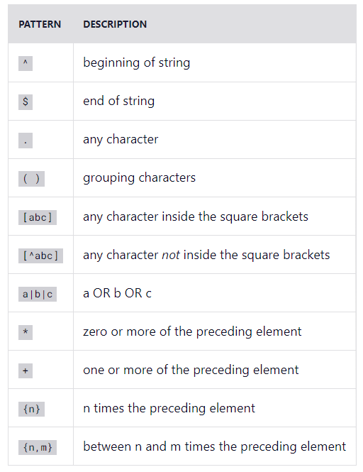
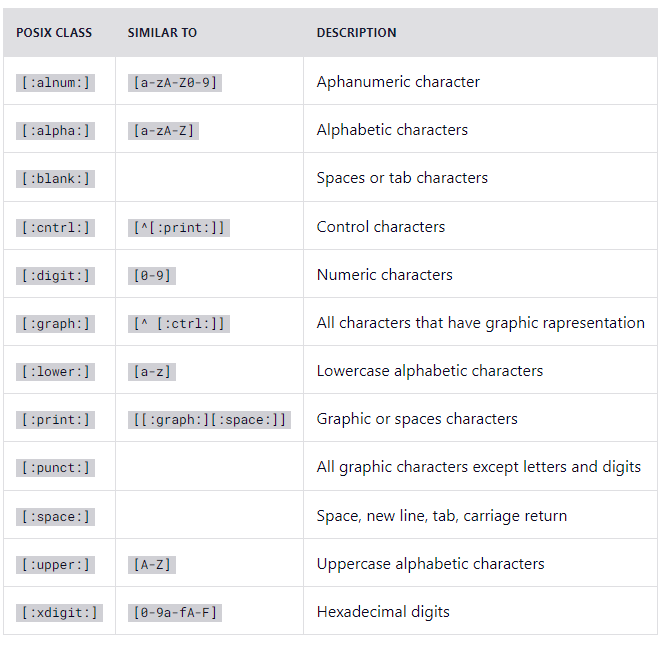
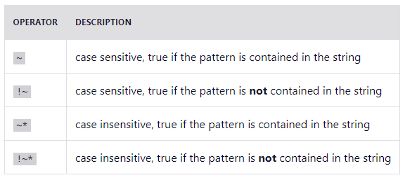

# Contéudos 

## Sql Patterns

- LIKE: Verifica se uma determinada string está em um padrão.
Principais operadores:
'%' - qualquer caractere
'-' - apenas um caractere, qualquer que seja ele. NOT LIKE: é o oposto do like.

`SELECT name FROM planets
  WHERE name LIKE "%us";`

- SIMILAR TO: pode ser usado como algo adicional ou complementar ao like.

`SELECT name FROM planets
  WHERE name SIMILAR TO "%us";`

- Expressão Regular (Regex)
É um recurso poderoso de varias linguagens que é responsavel permite combinar caracteres de forma mais específica.
Operadores:

IMPORTANTE: SQL SERVER NÃO TEM SUPORTE PARA REGEXP